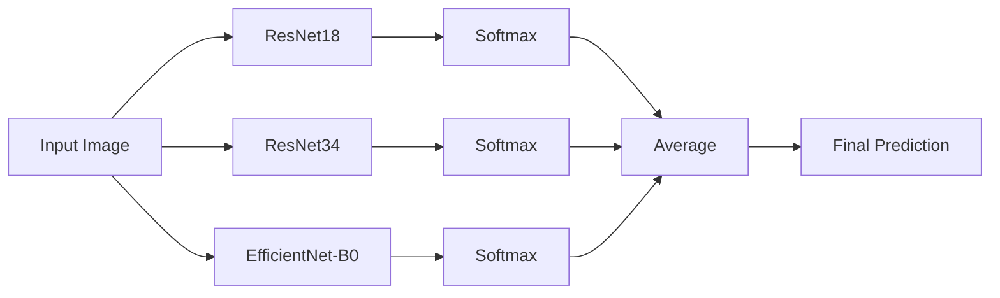

# Ensemble Learning for ImageNetSubset Classification

This document explains the multi-architecture ensemble learning setup for classifying images from the ImageNetSubset dataset.

## Overview

The ensemble combines predictions from **three different CNN architectures** to achieve higher accuracy than any single model. Each architecture has different inductive biases, allowing the ensemble to capture diverse features.



## Model Architectures

| Model | Parameters | Architecture Style | Strengths |
|-------|-----------|-------------------|-----------|
| **ResNet18** | 11M | Skip connections, 18 layers | Fast, good baseline |
| **ResNet34** | 21M | Skip connections, 34 layers | Deeper, more capacity |
| **EfficientNet-B0** | 5M | Compound scaling, mobile-optimized | Efficient, different feature extraction |

### Why These Models?

1. **Diversity**: ResNet and EfficientNet use fundamentally different building blocks
2. **Pretrained**: All models have ImageNet pretrained weights
3. **Efficiency**: All run efficiently on M1 Mac with MPS acceleration
4. **Proven**: Industry-standard architectures with well-understood behavior

## Dataset

The ImageNetSubset contains 10 classes from the original ImageNet dataset. We recommend an **80/10/10 split** (Train/Val/Test) for robust evaluation.

| Class | Total Images | Train (80%) | Val (10%) | Test (10%) |
|-------|--------------|-------------|-----------|------------|
| binder | 1,300 | 1,040 | 130 | 130 |
| coffee_mug | 1,300 | 1,040 | 130 | 130 |
| computer_keyboard | 1,300 | 1,040 | 130 | 130 |
| mouse | 1,300 | 1,040 | 130 | 130 |
| notebook | 1,300 | 1,040 | 130 | 130 |
| remote_control | 1,300 | 1,040 | 130 | 130 |
| soup_bowl | 1,300 | 1,040 | 130 | 130 |
| teapot | 1,300 | 1,040 | 130 | 130 |
| toilet_tissue | 1,300 | 1,040 | 130 | 130 |
| wooden_spoon | 1,300 | 1,040 | 130 | 130 |
| **Total** | **13,000** | **10,400** | **1,300** | **1,300** |

### Datset Splitting

Use the provided utility to split your dataset. This tool is safe (non-destructive by default) and reproducible.

```bash
# 1. Preview the split (Dry Run)
python experiments/scripts/split_dataset.py --data-dir ImageNetSubset --dry-run

# 2. Apply the split
python experiments/scripts/split_dataset.py --data-dir ImageNetSubset
```

## Training

### Requirements

```bash
# Create and activate virtual environment
python3 -m venv venv
source venv/bin/activate

# Install dependencies
pip install -r requirements.txt
```

### Train Each Model

Each model is trained independently with transfer learning.

```bash
# Train ResNet18
python experiments/scripts/train_single_model.py --model resnet18 --epochs 5 --wandb

# Train ResNet34
python experiments/scripts/train_single_model.py --model resnet34 --epochs 5 --wandb

# Train EfficientNet-B0
python experiments/scripts/train_single_model.py --model efficientnet_b0 --epochs 5 --wandb
```

### Training Configuration

| Parameter | Value | Rationale |
|-----------|-------|-----------|
| Epochs | 5 | Pretrained models converge quickly on this subset |
| Batch Size | 32 | M1 memory-friendly |
| Learning Rate | 0.001 | Standard for fine-tuning |
| Optimizer | SGD + Momentum (0.9) | Proven for image classification |
| LR Schedule | StepLR (step=7, γ=0.1) | Gradual decay |

Checkpoints are saved to `checkpoints/` (e.g., `best_resnet18_seed42.pth`).

## Ensemble Inference

### How It Works

1. **Load Models**: Each checkpoint is loaded with its corresponding architecture
2. **Forward Pass**: Input image is processed by all models
3. **Softmax**: Each model outputs a probability distribution over 10 classes
4. **Average**: Probabilities are averaged element-wise
5. **Argmax**: Final prediction is the class with highest averaged probability

### Usage

```bash
# Evaluate on the TEST set (Recommended)
python experiments/scripts/ensemble_inference.py --evaluate --split test

# Evaluate on Validation set
python experiments/scripts/ensemble_inference.py --evaluate --split val

# Single image inference
python experiments/scripts/ensemble_inference.py --image path/to/image.jpg

# Batch inference on directory
python experiments/scripts/ensemble_inference.py --image-dir custom_images/
```

### Output Example

```
📷 Image: test_coffee_mug.jpg
--------------------------------------------------
🎯 Ensemble Prediction (top 5):
   1. coffee_mug           ████████████████░░░░  82.3%
   2. teapot               ██░░░░░░░░░░░░░░░░░░   8.5%
...
```

## Expected Performance

| Configuration | Test Accuracy (Est.) |
|--------------|---------------------|
| ResNet18 alone | ~87-90% |
| ResNet34 alone | ~88-91% |
| EfficientNet-B0 alone | ~86-89% |
| **Ensemble (3 models)** | **~91-94%** |

## File Structure

```
project/
├── src/                         # Python package
│   ├── experiments/
│       ├── src/
│       │   ├── models/          # Model architectures
│       │   ├── data/            # Data loading
│       │   ├── training/        # Training logic
│       │   └── ensembling/      # Ensemble inference logic
├── experiments/
│   ├── scripts/                 # CLI entry points
│   │   ├── train_single_model.py
│   │   ├── ensemble_inference.py
│   │   └── split_dataset.py     # <--- NEW: Dataset splitter
│   ├── configs/
│   │   └── default.yaml
│   ├── docs/
│   │   └── ensemble.md
│   └── checkpoints/
├── ImageNetSubset/
│   ├── train/
│   ├── val/
│   └── test/                    # <--- NEW: Test set
├── requirements.txt
└── venv/
```

## Weights & Biases Integration

Training runs are logged to [Weights & Biases](https://wandb.ai).

```bash
python experiments/scripts/train_single_model.py --model resnet18 --wandb --wandb-project imagenet-subset-ensemble
```
